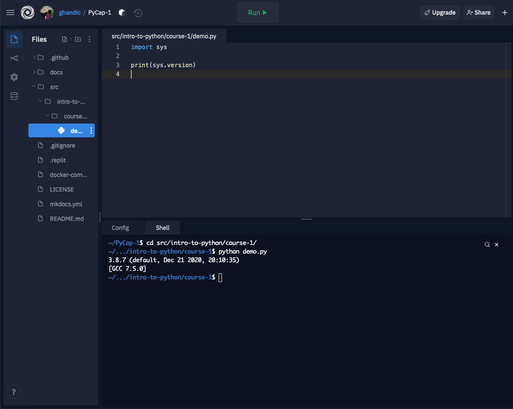

# Welcome to PyCap
Welcome everyone to PyCap! The new and growing community of Python enthusiasts and professionals across Capgemini. 
We are running the first course of 2021: Python Foundations. This course will serve as an introduction to Python and an opportunity for everyone to dip their toes into programming. This course will provide you with the knowledge to begin using Python on project or for your own personal projects. We hope you will enjoy your stay with us and be part of this growing community. 

## Get to know Python
Python :snake: is a popular and is an easy to learn, powerful programming language.
It is used for many things, such as
- Software Development
- Web Application
- Scripting
- AI and Machine Learning

As you can see, lots of cool and interesting things to build :satisfied:

## Getting Started

### Instant development environment

We will be using repl.it for this course. It is an online development playground that let you start without any of the hassels to setup. Trust me, I wish I know about it when I was learning Python. :smirk:

To immediately get access to a development environment [click here](https://repl.it/github/CapgeminiInventIDE/PyCap), this should set you up with a repl.it IDE in your browser with all the code in this course. It should look very similar to  the below image.



### Working locally
If you are a little bit brave and interested in working locally on your laptop, you can set up the development environment with the programs listed below :wink:

First ensure you have `git`, `VSCode` and `Python` (3.6+) installed, open up your terminal/command prompt and run the following

- [Python](https://www.python.org/downloads/) (Ensure you download Python 3.6+)
- [VSCode](https://code.visualstudio.com/download)
- [Git](https://git-scm.com/downloads)

Now you're ready to clone the PyCap repo and open it in vscode

```bash
git clone https://github.com/CapgeminiInventIDE/PyCap.git
code PyCap
```
