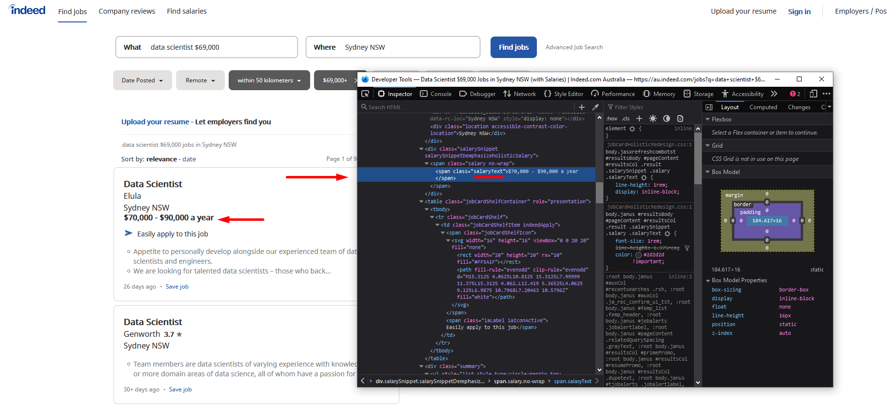
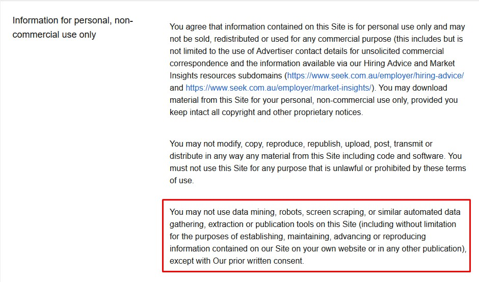

{{ course_summary(title, date, mentors=mentors, links=links) }}

# PyCap Intro to Python Capstone - Scraping the web for data

Capstone example of applying the learnings from PyCap intro to Python and create a web scraper to programmatically gather and analyse information 
## Problem
### Introduction to Web Scraping 
Create a basic commandline application using Python 3.6+ that allows a user scrap an information from various website and save out the information to be use later. 
In this exercise we will scrape 2 website, stock information from ASX and job postings on indeed.
#### Starting point for Web Scraping
The starting step for webscraper is to familiarise yourself with the website you want to gather information from. These steps can include examining the website's URL
and inspecting the website (Press F12 on your keyboard) for the element you're interested in.
##### Example

As it can be observe, some of the information can already be picked up such as the query for data scientist and location of Sydney, NSW.

We can also observe from inspecting the page that the salary information is under a class "SalaryText", which we can use to implement our scraper. 
### Basic Data Analysis
We will also introduce some basic data analysis on the the scraped data.
To perform the analysis, we will have to create a basic commandline application using Python 3.6+ that analyses our scraped data: 
- With ASX data, we will see if we can determine the change in stock price based on the ASX Today Announcement. 
- With Indeed data, we will see if we can filter our scraped data and display jobs within our specified salary range.    
## Coding Standard and Practice
Your code should be well-documented with a docstrings, comments and a README describing how your program works, unit tests to ensure it works as expected and type annotations and finally well formatted using Black. This is so other developers can understand how to help build upon your program.

You should add a summary to your README that includes the next steps (dot points) and also the strengths and weaknesses of your program in its current state.
A list of operations that your app should support, as well as how we expect them to show up can be found in the table below.

| Operation                                            | Usage | Commandline Output |
|------------------------------------------------------|-------|-------------|
| Start the scaping process on the provided link | `"python3 webscraper.py "<Site URL>""` |
| Finish Scraping | | Successfully Scraped the "Site URL" |Example of scraped data from indeed  |
| Start analysis for ASX | `"python3 analysis.py asx""` | Beginning Analysis for ASX data |
| Finish analysis for ASX | |  Successfully Analysed ASX data |
| Start analysis for indeed | `"python3 analysis.py indeed""` | Beginning Analysis for indeed data |
| Finish analysis for indeed | |  Successfully Analysed indeed data |
## Suggested URLs for Webscraping

- https://www2.asx.com.au/markets/trade-our-cash-market/todays-announcements
- ASX URL of the companies you are interested in (Hint: you can store the companies in a list)
- https://au.indeed.com/jobs?q=data+scientist&l=Sydney+NSW
- Indeed URL with your job and city queried (Hint: you can store jobs in a list)

## Suggested Library

- [Beautiful Soup](https://www.crummy.com/software/BeautifulSoup/bs4/doc/) 
- [Scrapy](https://scrapy.org/)
- [Selenium](https://selenium-python.readthedocs.io/)
- When in doubt, **Research** and **Google** are your friends :sunglasses:

## Disclaimer
Certain websites impose restrictions on scraping/gathering their data and information programmatically. 
Due to the simplicity of our scraper, if the script doesn't work and your code looks fine, it could mean that the sites contain levels of security to prevent
scraping.

These sites can also have Terms and Conditions restricting on the automation data gathering tool. 
Since you are not using them for commercial purposes, you should be alright. However always check for T&Cs in the future.
### Example of T&Cs:

## Optional Extras

- Enhance the scraper further and save the information out into csv file
- Analyse and utilise the data and create an application from it 
- Example for Advanced usage: Algorithm Trading on stock information or Resume Skill Matching for job posting