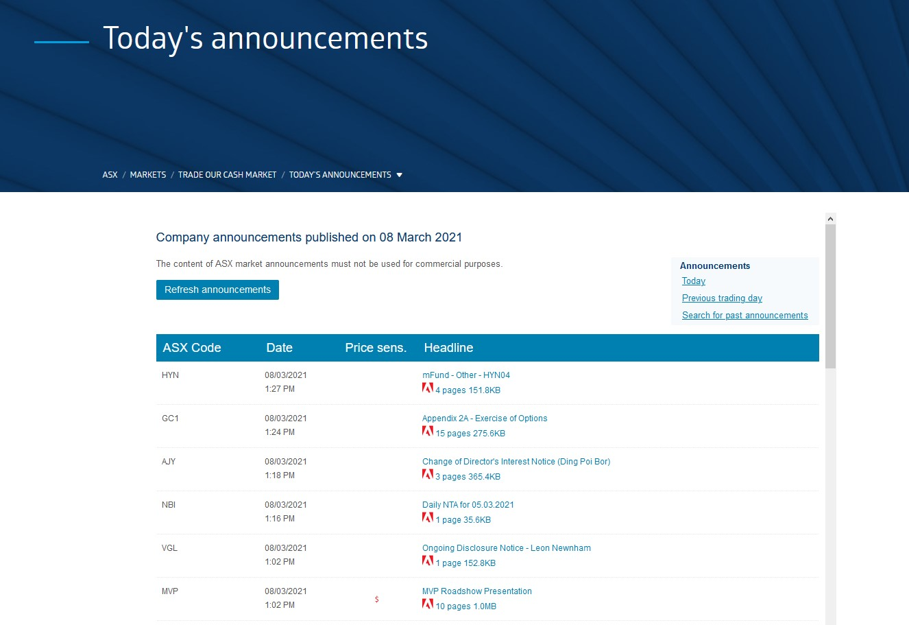

# PyCap Intro to Python Capstone - Scraping the web for data

Capstone example of applying the learnings from PyCap intro to Python and create a web scraper to programmatically gather and analyse information

## Problem

### Introduction to Web Scraping

Create a basic commandline application using Python 3.6+ that allows a user scrap an information from various website.
In this exercise we will scrape job postings from indeed website.

#### Starting point for Web Scraping

The starting step for webscraper is to familiarise yourself with the website you want to gather information from. These steps can include examining the website's URL
and inspecting the website using browser's developer tools.

##### Example

### Basic Data Analysis

We will also introduce some basic data analysis on the the scraped data.
To perform the analysis, we will have to create a basic commandline application using Python 3.6+ that analyses our scraped data:

- Indeed data, we will see if we can filter our scraped data and display jobs within our specified salary range and industry within Australia.

## Coding Standard and Practice

Your code should be well-documented with a docstrings, comments and a README describing how your program works, unit tests to ensure it works as expected and type annotations and finally well formatted using Black. This is so other developers can understand how to help build upon your program.

You should add a summary to your README that includes the next steps (dot points) and also the strengths and weaknesses of your program in its current state.
A list of operations that your app should support, as well as how we expect them to show up can be found in the table below.

| Operation                                            | Usage |
|------------------------------------------------------|-------|
| Start the scaping process| `"python3 webscraper.py --no-cache"` |
| Start the scaping process and save the response (scraped data) into local file | `"python3 webscraper.py --cache"`|
| Extract all job postings based on the location Australia | `"python3 webscraper.py --location "Australia"` |
| Extract all job postings based on the company rating of 3 and above and location Australia | `"python3 webscraper.py --rating "3" --location "Australia""`|
| Extract all job postings based on the salary range greater than $65000 and location Australia | `"python3 webscraper.py --salary "65000" --location "Australia""`|
| Extract all job postings based on the job title "Consulting" and location Australia | `"python3 webscraper.py --job "Consulting" --location "Australia""`|
| Save the jobs into json file | `"python3 webscraper.py --job "Consulting" --location "Australia" --saved"` |
| Finish Scraping | Successfully Web Scraped  |

## Suggested URLs for Webscraping

- <https://www2.asx.com.au/markets/trade-our-cash-market/todays-announcements>
- ASX URL of the companies you are interested in (Hint: you can store the companies in a list)
- <https://au.indeed.com/jobs?q=data+scientist&l=Sydney+NSW>
- Indeed URL with your job and city queried (Hint: you can store jobs in a list)

## Suggested Library

- [Beautiful Soup](https://www.crummy.com/software/BeautifulSoup/bs4/doc/)
- [Scrapy](https://scrapy.org/)
- [Selenium](https://selenium-python.readthedocs.io/)
- When in doubt, **Research** and **Google** are your friends :sunglasses:

## Suggested Additional Learning Resources

- [Beautiful Soup: Build a Web Scraper With Python](https://realpython.com/beautiful-soup-web-scraper-python/#challenges-of-web-scraping)
- [Web Scraping with Python - Beautiful Soup Crash Course](https://www.youtube.com/watch?v=XVv6mJpFOb0)

## Disclaimer

Certain websites impose restrictions on scraping/gathering their data and information programmatically.
Due to the simplicity of our scraper, if the script doesn't work and your code looks fine, it could mean that the sites contain levels of security to prevent
scraping.

These sites can also have Terms and Conditions restricting on the automation data gathering tool.
Since you are not using them for commercial purposes, you should be alright. However always check for T&Cs in the future.

### Example of T&Cs

## Optional Extras

- Enhance the scraper further and save the information out into csv file
- Analyse and utilise the data and create an application from it
- Example for Advanced usage: Algorithm Trading on stock information or Resume Skill Matching for job posting

## Optional Activity (Bonus)

With ASX data, we will see if we can determine the change in stock price based on the ASX Today Announcement.

### Web Scraping with ASX

We will be talking about some of the steps that would let you start on analysing the change in stock price.
Hint: ASX is a dynamic website, it is highly recommend that you check out Selenium library for your solution

- We need to identify which stocks have their announcement today, we can use our web scraper to extract the listed stocks from the page

- Then we can use the our extracted stocks and use the web scraper to fetch the today price and today's change from the selected stock pages

- We can then determine if there is any correlation between the announcement and the change in stock price for today
